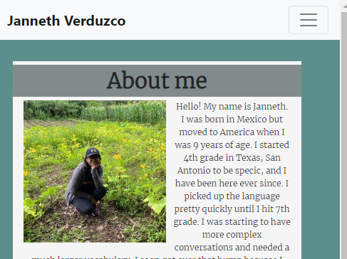

# Janneth Alvarado Verduzco Portfolio  

## Description
My portfolio features my previous projects. The projects vary in content but the basis of  the technology used across these projects is HTML5, CSS, JavaScript, jQuery, and some use of API’s. There is a contact section where one can provide the required information to be contacted by me. There is also a section About Me where you can get to know a little about me.


## User Story

```
AS AN employer seeking a candidate  
I WANT to be provided with the contact information, existing projects, and some information about the candidate’s background
SO THAT the I can make an informed decision 
```
## Mock-Up



## Deployed Link
https://jannverduzco.github.io/responsive-portfolio/

## GitHub Repository Link
https://github.com/jannverduzco/responsive-portfolio


